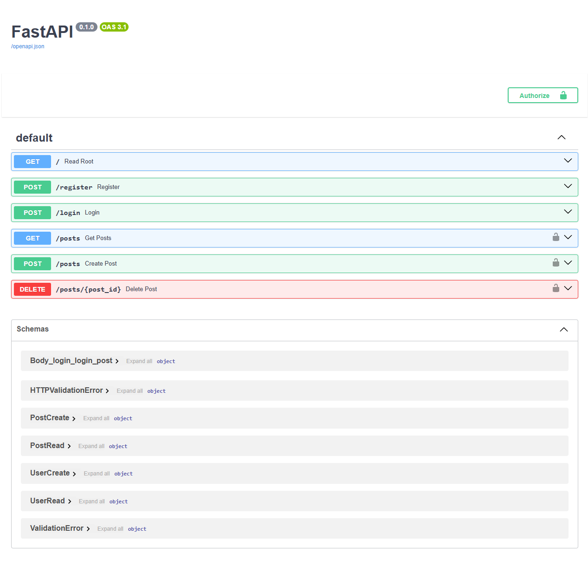

# PostAPI


## Description
PostAPI is a lightweight FastAPI app for secure user signup, login, and simple text posting with in-memory storage and JWT authentication.


## Technologies Used
- Python
- FastAPI
- Pydantic
- JWT


## Features
- User registration and login with JWT authentication
- Create, read, and delete posts stored in memory
- Secure password hashing using bcrypt


## Setup
To install the project locally on your computer, execute the following commands in a terminal:
```bash
git clone https://github.com/Illya-Maznitskiy/post-api.git
cd post-api
python -m venv venv
venv\Scripts\activate (on Windows)
source venv/bin/activate (on macOS)
pip install -r requirements.txt
```


## Set environment variables:
Create a `.env` file in the project root with:
```
SECRET_KEY=your_secret_key_here
```


## Run the app
Open the terminal and use the following command:
```bash
uvicorn app.main:app --reload
```
The app will be available at http://localhost:8000.


## API Endpoints
You can explore all endpoints at http://localhost:8000/docs page

Main Endpoints:
- POST /register — Register new user
- POST /login — User login, returns JWT token
- POST /posts — Create a post (requires auth)
- GET /posts — Get posts for current user (requires auth)
- DELETE /posts/{post_id} — Delete post by ID (requires auth)


## Testing
Run flake8 to check for style issues:
```
flake8
```


## Screenshots


